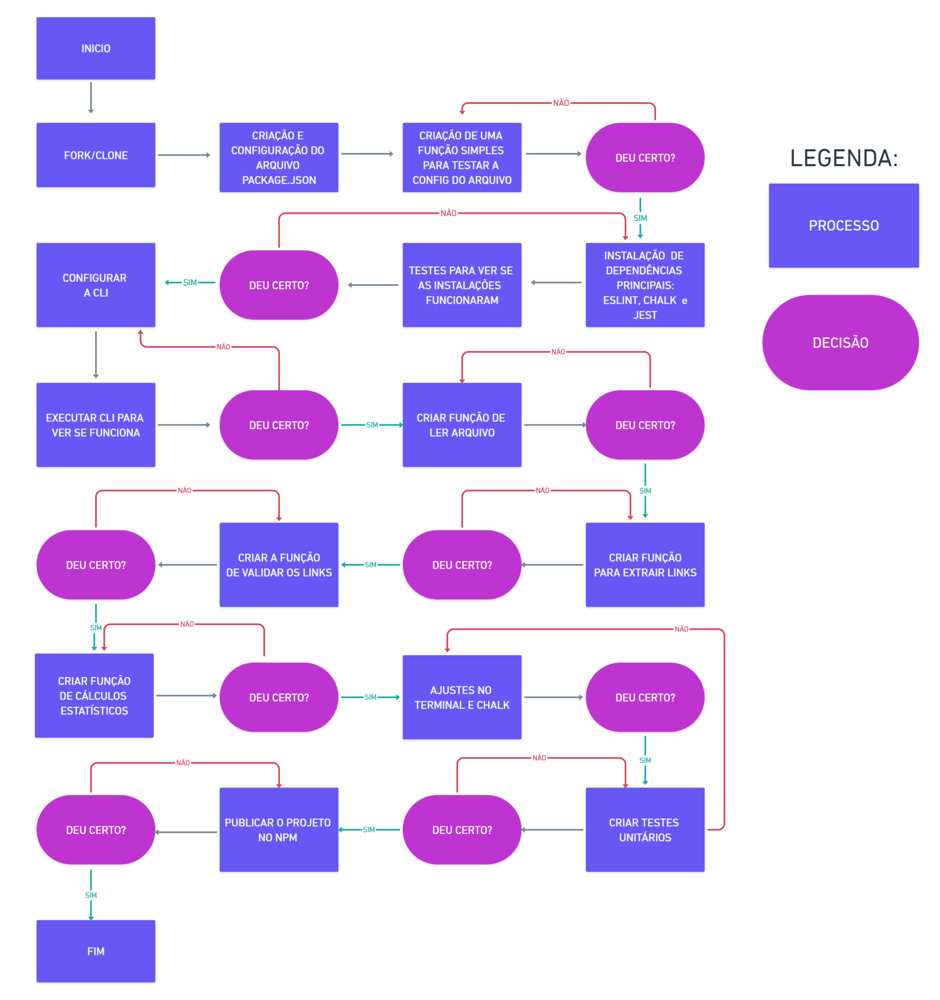
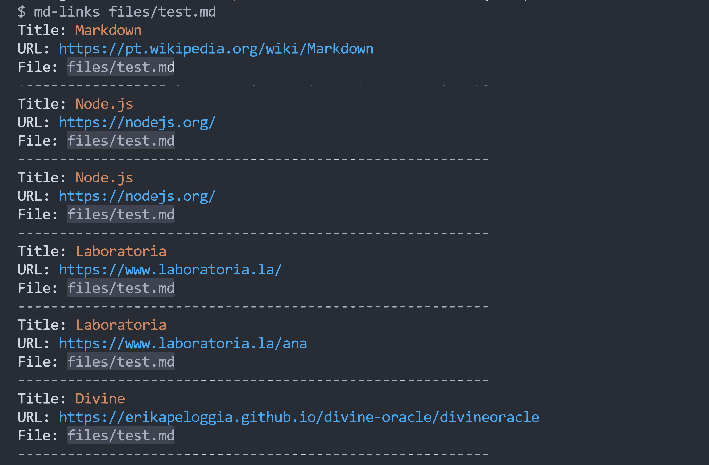
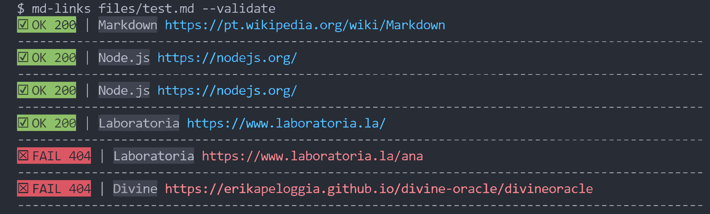
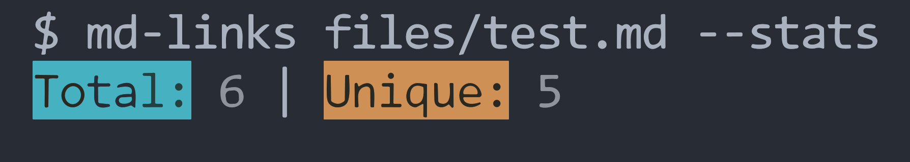
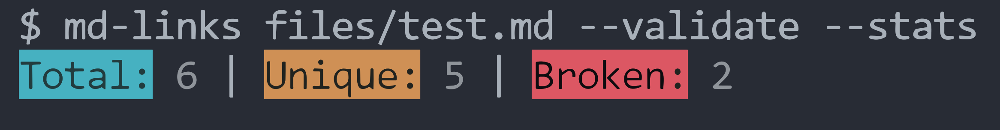
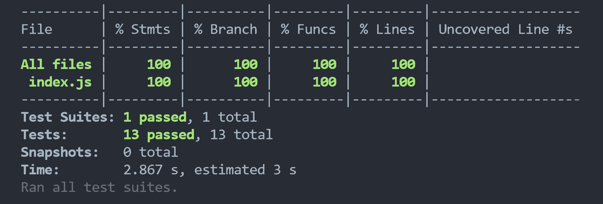

# Markdown Links

## Índice

* [1. Prefácio](#1-prefácio)
* [2. Fluxograma](#2-fluxograma)
* [3. Funcionalidades Principais](#3-funcionalidades-principais)
* [4. Guia de Instalação e Uso](#4-guia-de-instalacao-e-uso)
* [5. Testes Unitários](#5-testes-unitarios)
* [6. Tecnologias Utilizadas](#6-tecnologias-utilizadas)
* [7. Autor](#7-autor)
  
***

## 1. Prefácio

[Markdown](https://pt.wikipedia.org/wiki/Markdown) é uma linguagem de marcação
muito popular entre os programadores. É usada em muitas plataformas que
manipulam texto (GitHub, fórum, blogs e etc) e é muito comum encontrar arquivos
com este formato em qualquer repositório (começando pelo tradicional
`README.md`).

O Objetivo deste projeto é desenvolver uma biblioteca que lê arquivos Markdown através de uma CLI (command-line interface) que possiblita a execução da biblioteca no terminal, a partir de um módulo do Node.js, no qual, este irá fazer a leitura dos arquivos em formato `Markdown('.md')`, verificando a existência de links e estatisticas que nele existem.

#


## 2. Fluxograma



## 3. Funcionalidades Principais
* Leitura de arquivos Markdown ('.md') a partir da linha de comando.
* Extração de links contidos nos arquivos Markdown.
* Validação de links contidos nos arquivos Markdown.
* Geração de estatísticas.

## 4. Guia de Instalação e Uso
Instale a biblioteca no terminal através do comando:
```
npm install md-links-anabfer
```
* Para extrair links de um arquivo Markdown, execute:
```
md-links <caminho-do-arquivo>
```


* Para validar links de um arquivo Markdown, execute:
```
md-links <caminho-do-arquivo> --validate
```


* Para gerar estatísticas de um arquivo Markdown, execute:
```
md-links <caminho-do-arquivo> --stats
```


* Para validar links e gerar estatísticas de um arquivo Markdown, execute:
```
md-links <caminho-do-arquivo> --validate --stats
```


## 5. Testes Unitários
A aplicação foi finalizada com 100% de cobertura nos testes:



## 6. Tecnologias Utilizadas
    

## 7. Autor
Ana Beatriz Ferreira
* github: [@anabfer](https://github.com/anabfer)
* Linkedin: [@anabfer](https://www.linkedin.com/in/anabfer)
